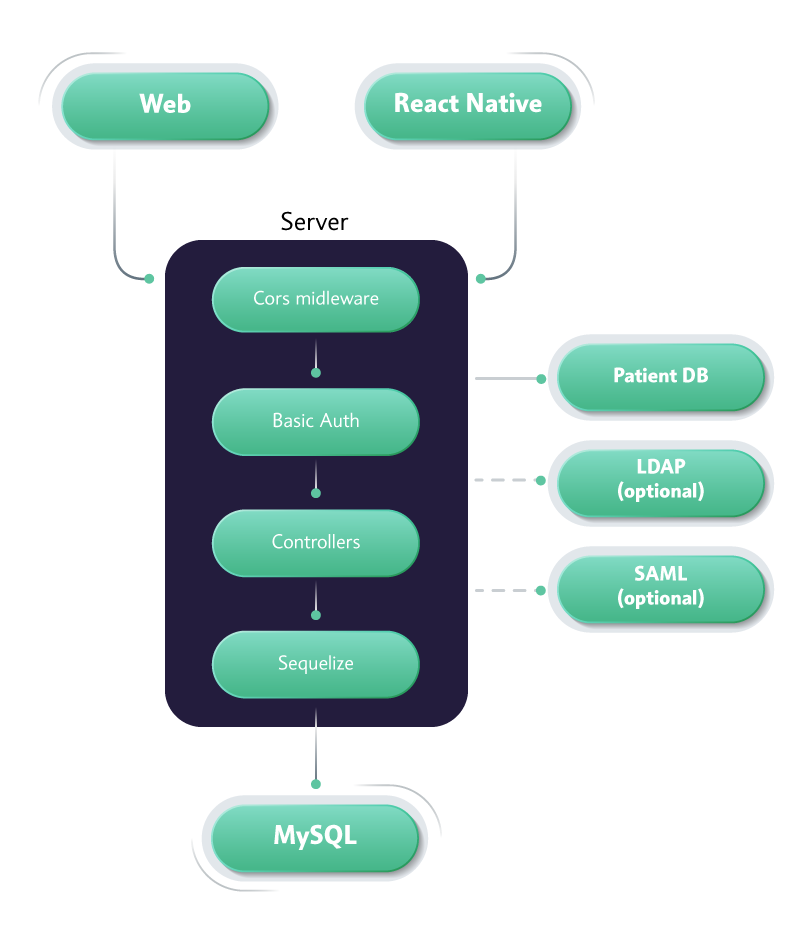
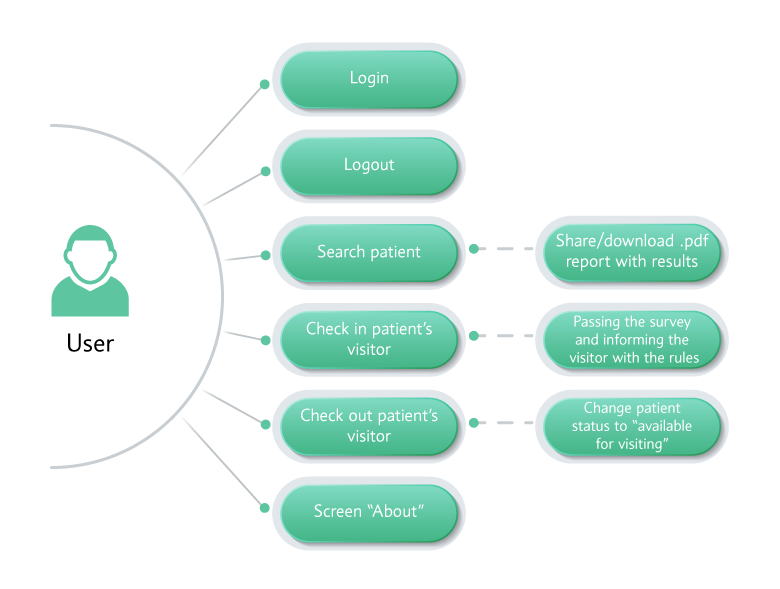

# Visitor Access
The Visitor Access App was designed to help hospitals controlling the access of visitors to the patients. The application can be used by hospital guards or administrators. It contains a questionnaire with a few health-related questions. These questions determine whether visitors have certain conditions that might prevent them from visiting a patient (i.e. cough or temperature). Based on the answers, the hospital guard or administrator either grants the permission for a visit or declines it. The procedure of checking visitors includes the following steps: asking for the patient's name and floor and then asking the visitor to go through the questionnaire. If the visitor is allowed to visit, the system will display the exact time of the visit and the person responsible for granting access.
# Tech Stack
### Frontend, Mobile application
- [React](https://github.com/facebook/react) / [React Native](https://facebook.github.io/react-native/)
- [React Navigation](https://github.com/react-community/react-navigation)
- [Redux](https://redux.js.org/)
- [Redux-Persist](https://github.com/rt2zz/redux-persist)
### Backend
- [Express](https://github.com/expressjs/express)
- [Sequelize](https://github.com/sequelize/sequelize) 
- [Swagger](https://github.com/swagger-api/swagger-node)
# Architecture

# Use case diagram

# Contact information
<contact@kandasoft.com>
# License
This code is distributed under the terms and conditions of the [MIT](LICENSE)
